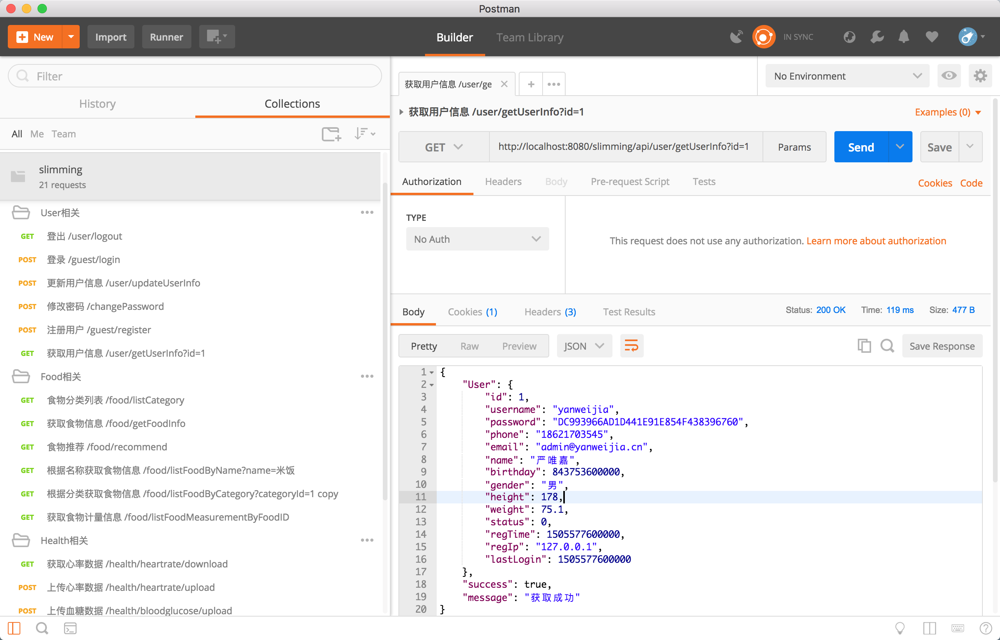

# slimming_server
[课程设计] 减肥app服务器端,仅api , 无页面

项目对应客户端(Android) 地址: [Slimming_Android_github](https://github.com.yanweijia/slimming_android) 或 [Slimming_Android_Coding](https://git.coding.net/yanweijia/slimming_android.git)

数据库使用 mysql ,建表语句及初始数据请点击: [slimming.sql](files/slimming_2017-10-25.sql)

项目测试使用的是 Postman ,已将所有测试数据导出为 json文件,可以直接将次json 导入到自己的 postman 中

json 配置文件: [slimming.postman_collection.json](files/slimming.postman_collection.json)

截图:
